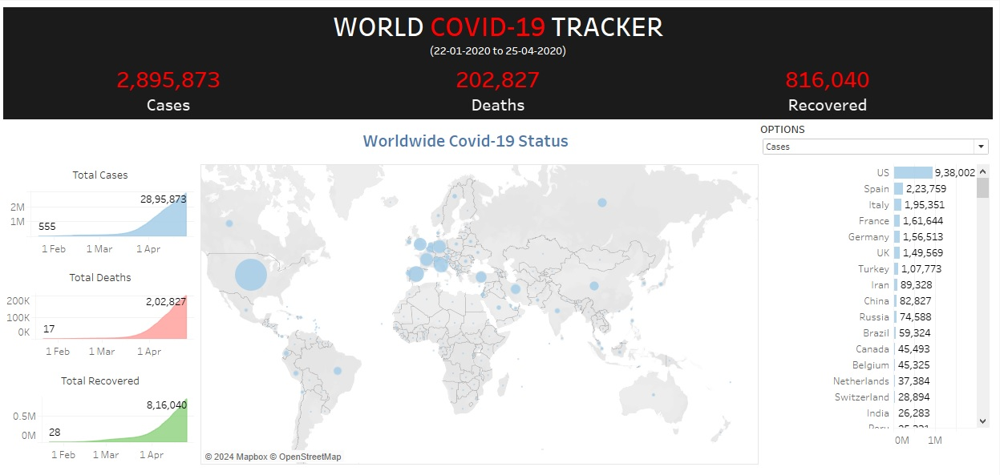
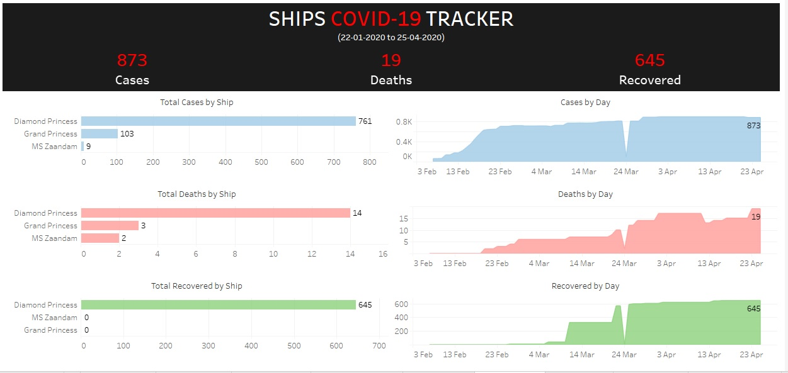
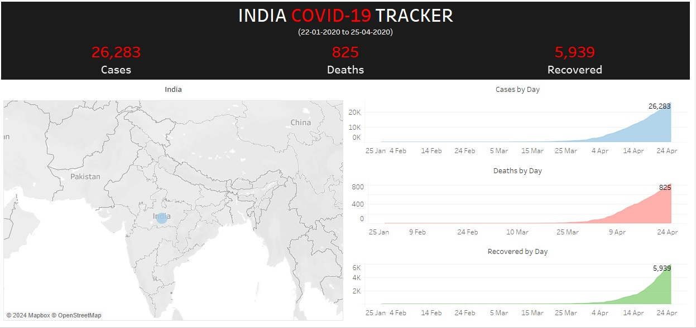
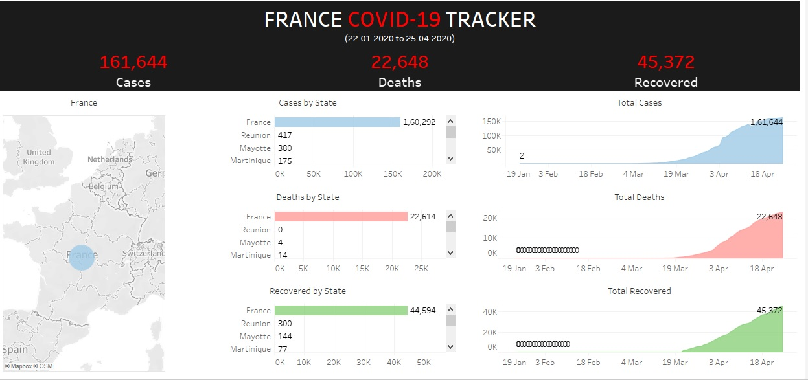

# Covid-19 Tracker Dashboard

## A. Dashboard Design Approach:
- ### Description: 
  The dashboard displays the information about Covid-19 spread worldwide between 22nd
January, 2020 and 25th April, 2020.

- ### Audience: 
  This dashboard is designed for general public to understand the spread of Covid-19
worldwide.

- ### Goal:
1. Dashboard will help in understanding the worldwide spread in terms of number of cases, deaths,
and recoveries. This dashboard displays the information by using maps, tables, and charts.
2. Users will have the flexibility to filter the information based on the cases, deaths, and recovery.
3. It is an interactive dashboard.

- ### Questions answered with dashboard:
1. What are the total number of cases, deaths, and recoveries overall?
2. Which are the most or least affected countries or regions?
3. Cruise ships suffering with Covid-19 impact.
4. Covid-19 spread in India.
5. Covid-19 spread in France and its provinces.

- ### Update Frequency: 
  Whenever new data is available.

## B. Metrics:
<table border=1>
    <tr>
        <th style="text-align:center;">Goal</th>
        <th style="text-align:center;">Metric</th>
        <th style="text-align:center;">Level of Detail</th>
    </tr>
    <tr>
        <td>Worldwide</td>
        <td>
            <ul>
                <li>Total number of cases, deaths, recoveries</li>
                <li>Most affected</li>
            </ul>
        </td>
        <td>
            <ul>
                <li>Overall values, geographic, spread</li>
                <li>Countries</li>
            </ul>
        </td>
    </tr>
    <tr>
        <td>Ships</td>
        <td>
            <ul>
                <li>Total number of cases, death, recoveries</li>
                <li>Cases, deaths, recoveries</li>
                <li>Cases, deaths, recoveries</li>
            </ul>
        </td>
        <td>
            <ul>
                <li>Overall values</li>
                <li>Ship</li>
                <li>Spread</li>
            </ul>
        </td>
    </tr>
        <tr>
        <td>India</td>
        <td>
            <ul>
                <li>Total number of cases, death, recoveries</li>
                <li>Cases, deaths, recoveries</li>
            </ul>
        </td>
        <td>
            <ul>
                <li>Overall values, geographic</li>
                <li>Spread</li>
            </ul>
        </td>
    </tr>
        <tr>
        <td>France</td>
        <td>
            <ul>
                <li>Total number of cases, deaths, recoveries</li>
                <li>Cases, deaths, recoveries</li>
                <li>Cases, deaths, recoveries</li>
            </ul>
        </td>
        <td>
            <ul>
                <li>Overall values, geographic</li>
                <li>State</li>
                <li>Spread</li>
            </ul>
        </td>
    </tr>

</table>

## C. Visuals:
- Worldwide
<table border=1>
    <tr>
        <th style="text-align:center;">Metric and Level of Detail</th>
        <th style="text-align:center;">Visual Type</th>
    </tr>
    <tr>
        <td>Worldwide total number of cases, deaths, recoveries</td>
        <td>KPI Card</td>
    </tr>
    <tr>
        <td>Worldwide total number of cases, deaths, recoveries
by country</td>
        <td>Map</td>
    </tr>
    <tr>
        <td>Worldwide total number of cases, deaths, recoveries
by country</td>
        <td>Bar</td>
    </tr>
    <tr>
        <td>Worldwide impact of spread by date</td>
        <td>Area</td>
    </tr>
</table>

- Ships
<table border=1>
    <tr>
        <th style="text-align:center;">Metric and Level of Detail</th>
        <th style="text-align:center;">Visual Type</th>
    </tr>
    <tr>
        <td>Total number of cases, deaths, recoveries for ships</td>
        <td>KPI Card</td>
    </tr>
    <tr>
        <td>Total number of cases, deaths, recoveries by ships</td>
        <td>Bar</td>
    </tr>
    <tr>
        <td>Impact of spread by date for ships</td>
        <td>Area</td>
    </tr>
</table>

- India
<table border=1>
    <tr>
        <th style="text-align:center;">Metric and Level of Detail</th>
        <th style="text-align:center;">Visual Type</th>
    </tr>
    <tr>
        <td>Total number of cases, deaths, recoveries for India</td>
        <td>KPI Card</td>
    </tr>
    <tr>
        <td>Impact of spread by date for India</td>
        <td>Area</td>
    </tr>
</table>

- France
<table border=1>
    <tr>
        <th style="text-align:center;">Metric and Level of Detail</th>
        <th style="text-align:center;">Visual Type</th>
    </tr>
    <tr>
        <td>Total number of cases, deaths, recoveries for France</td>
        <td>KPI Card</td>
    </tr>
    <tr>
        <td>Total number of cases, deaths, recoveries by states</td>
        <td>Bar</td>
    </tr>
    <tr>
        <td>Impact of spread by date for France</td>
        <td>Area</td>
    </tr>
</table>

## D. Dataset:
- Source: Downloaded from the Internet.
- Original dataset: Multi-table dataset available in ‘covid_19_original_dataset.xlsx’ MS-Excel file.
- Data quality issues: All data quality issues are listed in "Data Issues.txt" file.
- Pre-Processing: Follow the IPython Notebook ‘DA_COV_19.ipynb’ file.
- Final dataset: Available in ‘Covid_19_final_dataset.csv’ and ‘Covid_19_final_dataset.xlsx’ files.
- Total records: 18,645
- Total features: 6

<table border=1>
    <tr>
        <th style="text-align:center;">S.No.</th>
        <th style="text-align:center;">Feature</th>
        <th style="text-align:center;">Description</th>
    </tr>
    <tr>
        <td>1.</td>
        <td>Report_Date</td>
        <td>Date on which the data is reported.</td>
    </tr>
    <tr>
        <td>2.</td>
        <td>Country_Region</td>
        <td>Country/Region of the Covid-19 spread.</td>
    </tr>
    <tr>
        <td>3.</td>
        <td>Province_State</td>
        <td>Province/State of the Covid-19 spread.</td>
    </tr>
    <tr>
        <td>4.</td>
        <td>Cases</td>
        <td>Total number of cases reported.</td>
    </tr>
    <tr>
        <td>5.</td>
        <td>Deaths</td>
        <td>Total number of deaths reported.</td>
    </tr>
    <tr>
        <td>6.</td>
        <td>Recovered</td>
        <td>Total number of recoveries reported.</td>
    </tr>
    
</table>

## E. Final Dashboard:
>
*Worldwide impact of Covid-19 spread*  

>
*Impact of Covid-19 spread on Cruise ships*  

>
*Impact of Covid-19 spread on India*  

>
*Impact of Covid-19 spread on France*  

## F. Future Enhancements:
- Dashboard can also include visuals showcasing impact of Covid-19 virus spread on various countries with their provinces/states.
- It can also include the filter based on date ranges.
